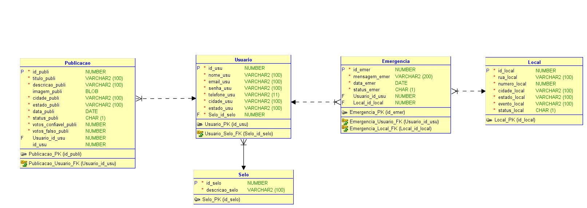

# CP4 - API + Banco Postgres + Dcocker Compose

## Instruções inciais

**1.** Clone esse repositório:
````sh
git clone https://github.com/eduardogdias/cp4_devops.git
````

**2.** Entre no diretório do projeto que contenha o arquivo `docker-compose.yml`:
````sh
cd cp4_devops
````

**3.** Crie um arquivo dentro do diretório chamado `.env` com o código abaixo:
````sh
POSTGRES_DB=cp4_database
POSTGRES_USER=cp4usu
POSTGRES_PASSWORD=cp4senha
````

---
A partir de agora todos os arquivos necessários para rodar o projeto em containers estão prontos:
- Dockerfile do banco e da API;
- Arquivo .yml com toda a especificação do Compose;
- Arquivo com as variáveis de ambiente devidamente configurado.
---

## Subindo os serviços
**4.** Suba os dois serviços em modo background (-d) com o comando abaixo e aguarde a contrução das imagens e criação dos containers:

````sh
docker compose up -d --build
````

Isso irá:

- Criar a rede cp4-network
- Subir o container do banco Postgres
- Subir a API conectada ao banco


---


## Consultando Logs 

Para consultar os logs dos dois serviços utilize `dockercomposelogs`. Caso prefira, pode informar o nome do serviço a ser consultado individualmente: `docker compose logs <nomeServiço>`

---

## Estrutura do Banco de Dados:

A API de JAVA faz o CRUD em 5 entidades e salva em duas respectivas tabelas:
- Emergencia ↔ tb_emergencia
- Local ↔ tb_local
- Publicacao ↔ tb—publicacao
- Selo ↔ tb_selo
- Usuario ↔ tb_usuario 



---

## Endpoints

**1. Selo:**

| Método | URI           | Descrição                     |
| ------ | ------------- | -----------------------------|
| GET    | `/selos`      | Lista todos os selos          |
| GET    | `/selos/{id}` | Busca um selo pelo ID         |
| POST   | `/selos`      | Cria um novo selo             |
| PUT    | `/selos/{id}` | Atualiza um selo existente    |
| DELETE | `/selos/{id}` | Deleta um selo pelo ID        |


**2. Usuario:**

| Método | URI            | Descrição                    |
| ------ | -------------- | ----------------------------|
| GET    | `/usuarios`    | Lista todos os usuários      |
| GET    | `/usuarios/{id}` | Busca um usuário pelo ID     |
| POST   | `/usuarios`    | Cria um novo usuário         |
| PUT    | `/usuarios/{id}` | Atualiza um usuário existente|
| DELETE | `/usuarios/{id}` | Deleta um usuário pelo ID    |


**3. Publicacao:**

| Método | URI                  | Descrição                                                                              |
|--------|----------------------|----------------------------------------------------------------------------------------|
| GET    | `/publicacoes`       | Lista todas as publicações                                                            |
| GET    | `/publicacoes?status=true/false` | Lista publicações filtrando por status (ativas/inativas)                          |
| GET    | `/publicacoes/{id}`  | Busca uma publicação pelo ID                                                          |
| POST   | `/publicacoes`       | Cria uma nova publicação                                                               |
| PUT    | `/publicacoes/{id}`  | Atualiza os dados de uma publicação existente                                          |
| DELETE | `/publicacoes/{id}`  | Deleta uma publicação pelo ID                                                         |


**4. Emergencia:**

| Método | URI                   | Descrição                                                         |
| ------ | --------------------- | ----------------------------------------------------------------- |
| GET    | `/emergencias`        | Lista todas as emergências registradas                           |
| GET    | `/emergencias/{id}`   | Busca uma emergência pelo ID                                     |
| POST   | `/emergencias`        | Cria uma nova emergência                                         |
| PUT    | `/emergencias/{id}`   | Atualiza os dados de uma emergência existente                    |
| DELETE | `/emergencias/{id}`   | Deleta uma emergência pelo ID                                    |


**5. Local:**

| Método | URI               | Descrição                                                                 |
|--------|-------------------|---------------------------------------------------------------------------|
| GET    | `/locais`         | Lista todos os locais                                                     |
| GET    | `/locais?status=true/false` | Lista locais filtrando por status (ativos/inativos)                          |
| GET    | `/locais/{id}`    | Busca um local pelo ID                                                   |
| POST   | `/locais`         | Cria um novo local                                                       |
| PUT    | `/locais/{id}`    | Atualiza os dados de um local existente                                  |
| DELETE | `/locais/{id}`    | Deleta um local pelo ID                                                  |

---

## Exemplos de Requisições


- Exemplo de Request **Selo**:
````json
{
    "descricao": "lendário"
}
````

- Exemplo de Request **Usuario**:
````json
{
    "nome": "Raquel",
    "email": "raquel@gmail.com",
    "senha": "111",
    "cidade": "Vitoria",
    "estado": "Espirito Santo",
    "telefone": "11990007777",
    "seloId": 3
}
````

- Exemplo de Request **Publicacao**:
````json
{
    "titulo": "Chava forte na Av. Paulista",
    "descricao": "A avenida está completamente alagada. Evitem passar por lá.",
    "imagem": "https://exemplo.com/imagem4.jpg",
    "cidade": "Campinas",
    "estado": "São Paulo",
    "votosConfiavel": 15,
    "votosFalso": 2,
    "usuario": {
        "id": 4
    }
}
````

- Exemplo de Request **Local**:
````json
{
    "rua": "Rua dos Apaixonados",
    "numero": 80,
    "cidade": "Sorocaba",
    "estado": "São Paulo",
    "evento": "EMERGENCIA"
}
````

- Exemplo de Request **Emergencia**:
````json
{
    "mensagem": "Preciso de um bote para usar na enchente.",
    "usuario": {
        "id": 1
    },
    "local": {
        "id": 3
    }
}
````


---

## Desligando os serviços

Você pode usar o comando ``docker compose down`` para encerrar os containers e a rede.
Ou ainda, utulizar o sufixo `-v` que vai deletar todos os volumes criados por determinado serviço.

---

## Solução de problemas (Troubleshooting)

### 1. Erro: psql: could not connect to server: Connection refused
**Causa:** O banco ainda não terminou de inicializar antes da API tentar conectar.

**Solução:** 
Veja o log do banco (`docker compose logs postgres`), aguarde alguns segundos e reinicie apenas a API: `docker compose restart api`

### 2. Erro: role "cp4usu" does not exist

**Causa:** O usuário do banco não foi criado corretamente.

**Solução:**

Verifique se o .env foi carregado corretamente.
Remova o volume (isso vai resetar o banco) e suba novamente:

````sh
docker compose down -v
docker compose up -d --build

````

### 3. Erro: Porta 5432 ou 8080 já está em uso

**Causa:** Outro processo está usando essas portas.

**Solução:**

Verifique quais processos estão ocupando as portas:
````sh
sudo lsof -i :5432
sudo lsof -i :8080
````
Finalize o processo ou altere as portas no `docker-compose.yml`.


### 4. Erro: Dados do banco sumiram após remover e reinciar os containers

**Causa:** O volume não foi removido.

**Solução:**

Provavelmente ao remover os container foi usado o comando:

````sh
docker compose down -v
````

O parâmetro `-v` remove todos os volumes, não sendo possível acessar os dados perdidos. Caso a intenção fosse apenas desligar os containers e deixar os dados salvos, era indicado usar:
````sh
docker compose down 
````
